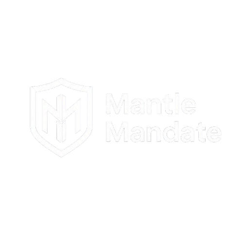

<div align="center">



# ⚡ MantleMandate

### Write Trading Rules in Plain English. AI Enforces Them On-Chain.

[](https://mantle-mandate-saa-s.vercel.app)
[](https://explorer.sepolia.mantle.xyz)
[](docs/Turing_Test_Hackathon_Requirements.md)
[](https://explorer.sepolia.mantle.xyz/address/0x690Ab021b40a01E9f3818CdBa149fb5721480871)
[](LICENSE)

> **Turing Test Hackathon 2026 — Trading & Strategy Track**

*Write a trading rule in English → Claude AI compiles it into a structured policy → the policy hash is committed on-chain → an AI agent executes it, with every decision — including holds — traceable to a live RSI reading, a Bybit price snapshot, and an on-chain `OrderExecuted` / `Swap` event.*

</div>

---

## 🌐 Live Demo & Contracts

| Resource | Link |
|----------|------|
| 🖥️ Frontend | [mantle-mandate-saa-s.vercel.app](https://mantle-mandate-saa-s.vercel.app) |
| 📜 MandatePolicy | [`0x690Ab021b40a01E9f3818CdBa149fb5721480871`](https://explorer.sepolia.mantle.xyz/address/0x690Ab021b40a01E9f3818CdBa149fb5721480871) |
| 🤖 AgentExecutor | [`0xbC8419baDaa69649940F2D4dDC01a2CFDEb408f6`](https://explorer.sepolia.mantle.xyz/address/0xbC8419baDaa69649940F2D4dDC01a2CFDEb408f6) |
| 🛡️ RiskGuard | [`0x8D99D4F922248852Bc678bd4018F9f3E4576E34B`](https://explorer.sepolia.mantle.xyz/address/0x8D99D4F922248852Bc678bd4018F9f3E4576E34B) |
| 🔄 MockSwapPool (mUSD/mWETH AMM) | [`0x3440d742bbbAe391b95E40FAF62d7a715582a4ad`](https://explorer.sepolia.mantle.xyz/address/0x3440d742bbbAe391b95E40FAF62d7a715582a4ad) |
| ⛓️ Network | Mantle Sepolia Testnet · Chain ID `5003` |

---

## ❓ The Problem

DeFi trading requires constant attention, technical expertise, and emotional discipline. Individual traders and small institutions lack tools to enforce strategy rules systematically — they trade on gut, break their own rules, and have no audit trail.

## 💡 The Solution

MantleMandate lets you write your investment strategy in plain English. Claude AI parses it into a structured policy, hashes it on-chain (immutable proof), and deploys an AI agent to execute it automatically — every decision recorded on Mantle Network forever.

**One-line pitch:** Write a trading rule in English → AI enforces it on-chain.

### 🌱 Why This Matters (Blockchain-for-Good)

Algorithmic, rule-based execution has historically been available only to funds and institutions with engineering teams. MantleMandate compiles a plain-English mandate into the same kind of policy-as-code institutions use — RSI-based entries, position-size caps, stop-loss/take-profit, cooldowns — and **commits it on-chain before any trade runs**, so the rules can't be silently changed after the fact.

This is deliberately not a "maximize PnL" leaderboard. The product is graded on **whether the agent followed its own committed rules**, with every decision (including holds) traceable to a live RSI reading, a Bybit price snapshot, and an on-chain `OrderExecuted`/`Swap` event. That's the same transparency a retail user would otherwise have no way to get from a black-box trading bot — reducing the information gap between retail and institutional execution, not chasing the highest return.

The platform's own subscription fee ($29–$299/mo, see [Plans](#-plans)) is flat and disclosed upfront — it does not scale with trade volume or PnL, so there's no incentive for the platform to encourage more or larger trades than a mandate calls for.

---

## 🏗️ Architecture

```
┌─────────────────────────────────────────────────────────────────┐
│                        USER INTERFACE                           │
│  Next.js 14 · TypeScript · Tailwind CSS · wagmi (Mantle chain) │
└─────────────────────┬───────────────────────────────────────────┘
                      │ HTTPS
┌─────────────────────▼───────────────────────────────────────────┐
│                      BACKEND API                                │
│  Flask 3.x · Python 3.12 · SQLAlchemy · Celery workers         │
│                                                                  │
│  ┌─────────────────┐   ┌──────────────────┐   ┌─────────────┐  │
│  │  Mandate Parser │   │  Agent Scheduler │   │  Risk Guard │  │
│  │  (Claude AI)    │   │  (Celery Beat)   │   │  Engine     │  │
│  └────────┬────────┘   └────────┬─────────┘   └──────┬──────┘  │
└───────────┼────────────────────┼────────────────────┼──────────┘
            │                    │                     │
┌───────────▼────────────────────▼─────────────────────▼──────────┐
│                    MANTLE NETWORK (Chain ID 5003)                │
│                                                                  │
│  ┌─────────────────┐  ┌──────────────────┐  ┌───────────────┐   │
│  │  MandatePolicy  │  │  AgentExecutor   │  │   RiskGuard   │   │
│  │  (Policy hash   │  │  (register +     │  │  (exposure    │   │
│  │   registry)     │  │   execute orders)│  │   limits)     │   │
│  └─────────────────┘  └──────────────────┘  └───────────────┘   │
└──────────────────────────────────────────────────────────────────┘
```

### 🔄 Core User Flow

```
1. Write mandate in plain English
       ↓
2. Claude AI parses it → structured policy (JSON)
       ↓
3. Policy hash submitted to MandatePolicy contract (on-chain proof)
       ↓
4. Deploy AI agent → registered in AgentExecutor contract
       ↓
5. Agent evaluates Mantle DeFi market conditions every 5 minutes
       ↓
6. Executes trades via AgentExecutor.executeOrder() — immutable record
       ↓
7. Full audit trail readable from on-chain OrderExecuted events
```

### 🧠 AI Decision Pipeline

Each trading cycle (`runAgentTick` in `frontend/lib/agentTick.ts`) is a deterministic pipeline, not a single opaque LLM call:

```
1. Fetch live Bybit ticker (price, 24h change, volume) for the mandate's asset
2. Fetch recent Bybit klines and compute RSI(14, 1h) — frontend/lib/indicators.ts
3. Send mandate policy + computed RSI + live market data to Claude
       ↓ Claude returns { action, confidence, reasoning, amount_pct, urgency }
4. Hard gate: hold or confidence < 65 → no trade, decision still recorded
5. Hard gate: live price/RSI unavailable → no trade (fail closed, not open)
6. For ETH/WETH: real on-chain swap on MockSwapPool, sized by mandate's riskPerTrade
7. AgentExecutor.executeOrder() — immutable on-chain record, referencing the swap tx
```

The computed RSI value, Claude's confidence score, and its one-sentence reasoning are all
shown in the dashboard for every cycle — including cycles where the agent decided **not**
to trade — so a user can audit whether the agent is actually following the mandate's
trigger condition, not just trust that it is.

### ⛓️ Smart Contracts

| Contract | Address (Mantle Sepolia) | Purpose |
|----------|--------------------------|---------|
| 📜 `MandatePolicy` | `0x690Ab021b40a01E9f3818CdBa149fb5721480871` | Immutable policy hash registry |
| 🤖 `AgentExecutor` | `0xbC8419baDaa69649940F2D4dDC01a2CFDEb408f6` | Agent lifecycle + trade execution |
| 🛡️ `RiskGuard` | `0x8D99D4F922248852Bc678bd4018F9f3E4576E34B` | On-chain risk parameter enforcement |
| 🔄 `MockSwapPool` | `0x3440d742bbbAe391b95E40FAF62d7a715582a4ad` | mUSD/mWETH constant-product AMM — agents execute real on-chain swaps here (Merchant Moe / Agni Finance have no Sepolia deployment to swap against) |
| 💵 `mUSD` (mock ERC20) | `0x61806e0D29b0aa200dC26e9C1F0380707a3210c9` | Test USD token, 6 decimals |
| Ξ `mWETH` (mock ERC20) | `0x535DC64B3eBDf3ce0ed1C03a8dfbEaf3A84e49EF` | Test ETH token, 18 decimals |

All six contracts are verified on Sourcify (full match), synced to Mantle Explorer.

### 🤖 AI Integration (Claude)

The mandate parser (`/api/mandates/parse`) calls Anthropic Claude with a structured prompt. It extracts:
- `asset` — which token to trade
- `trigger` — entry/exit conditions
- `riskPerTrade` — position size %
- `takeProfit` / `stopLoss` — exit thresholds
- `venue` — which Mantle DEX (Merchant Moe, Agni Finance, Fluxion)
- `schedule` — execution frequency

The output is hashed (SHA-256) and submitted on-chain, creating a cryptographic commitment to the strategy.

### 🛡️ Strategy Design & Risk Management

- **The mandate's bound wins, not the model's.** The AI recommends a position size (`amount_pct`), but `runAgentTick` clamps it to the mandate's own `riskPerTrade` ceiling before any execution — a confident "buy 80%" from Claude cannot exceed what the user's mandate allows, regardless of the AI's recommendation (`agentTick.ts`).
- **Fail closed on bad data.** If Bybit data is unavailable or the RSI can't be computed, the agent records "no trade" rather than guessing — an LLM is never asked to trade on data it doesn't have (`agentTick.ts`, "Live market data unavailable" path).
- **Confidence floor.** Claude's own confidence score must clear 65/100 before any trade is considered, and every "hold" or sub-threshold decision is still recorded and visible — so a user can see the agent *choosing not to act* as evidence it isn't over-trading.
- **On-chain kill switch.** `AgentExecutor.sol` models each agent as `Inactive → Active ⇄ Paused → Stopped`, enforced in the contract itself: `executeOrder()` reverts with `"AgentExecutor: agent not active"` for any agent that isn't `Active`. A user can pause an agent on-chain at any time.
- **`RiskGuard.sol`** (deployed and verified at the address above) implements full on-chain enforcement of drawdown limits, max concurrent positions, per-trade cooldowns, and position-size bounds via `checkOrder()`. It is not yet called from the live tick path — today those bounds are enforced in `agentTick.ts` itself (drawdown is read from Supabase and fed to the AI as context; position sizing is hard-capped as above). Wiring `checkOrder()` into `runAgentTick` so these bounds are enforced on-chain, not just in application code, is the top item under [Future Improvements](#-future-improvements).
- **Known limitation:** market-data inputs (Bybit price/volume/RSI) are read but not cross-validated against a second source. A manipulated or stale feed could still produce a misleading — though position-size-bounded — recommendation.

---

## 🛠️ Tech Stack

### ⛓️ Blockchain & Smart Contracts


- 5 production contracts deployed + verified on Mantle Sepolia (Chain ID `5003`)
- `MandatePolicy` — immutable on-chain policy hash registry
- `AgentExecutor` — agent lifecycle (`Inactive → Active ⇄ Paused → Stopped`) + `executeOrder()`
- `RiskGuard` — drawdown, position-size, cooldown and max-position checks via `checkOrder()`
- `MockSwapPool` + `mUSD`/`mWETH` — constant-product AMM for real on-chain swap execution

### 🌐 Frontend


- 22+ dashboard pages: agents, mandates, portfolio, trades, on-chain audit, risk engine, docs, support
- `ChatWidget` — Claude-powered support chat grounded in the docs hub (lite-RAG)
- MetaMask / wagmi wallet integration for on-chain mandate anchoring

### 🔧 Backend


- Flask 3.x REST API with JWT auth, rate limiting (Flask-Limiter), and CORS
- Celery + Celery Beat for scheduled agent ticks
- 49/49 backend tests passing (`pytest`)

### 🗄️ Database & Auth


- Supabase Postgres for relational data (mandates, agents, trades, users)
- Supabase Auth for email/password sessions
- Redis as the Celery broker/result backend

### 🤖 AI & Market Data


- Anthropic Claude Sonnet 4.5 (via OpenRouter) — mandate parsing + per-cycle trade decisions
- Bybit public spot API — live ticker + klines for RSI computation

---

## 📁 Project Structure

```
MantleMandate-SaaS/
│
├── 🌐 frontend/                    # Next.js 14 · TypeScript · Tailwind
│   ├── app/
│   │   ├── (auth)/                 # Login / signup
│   │   ├── api/
│   │   │   ├── agents/[id]/tick/   # On-chain trading-cycle execution
│   │   │   ├── agents/decide/      # AI decision pipeline (RSI + Bybit + Claude)
│   │   │   └── support/chat/       # Docs-grounded support chat (lite-RAG)
│   │   └── dashboard/              # 22+ pages: agents, mandates, portfolio, risk, docs...
│   ├── lib/
│   │   ├── agentDecision.ts        # getTradeDecision() — RSI + live data → Claude
│   │   ├── agentTick.ts            # runAgentTick() — gate, swap, executeOrder
│   │   ├── indicators.ts           # calculateRSI() — Wilder's RSI(14)
│   │   ├── bybit.ts                # Bybit spot ticker + klines client
│   │   ├── contracts.ts            # ABIs + deployed addresses
│   │   └── serverWallet.ts         # Service wallet (shadow agent execution)
│   └── hooks/                      # useAgents, useMandates, etc. (TanStack Query)
│
├── 🔧 backend/                     # Flask 3.x · Python 3.12 · Celery
│   ├── app/                        # Routes, models, services
│   ├── ai/                         # Mandate parsing (Claude)
│   ├── migrations/                 # Flask-Migrate / Alembic
│   └── tests/                      # 49/49 passing
│
├── ⛓️ blockchain/                  # Solidity 0.8.x · Hardhat
│   ├── contracts/
│   │   ├── MandatePolicy.sol       # Policy hash registry
│   │   ├── AgentExecutor.sol       # Agent lifecycle + executeOrder
│   │   ├── RiskGuard.sol           # On-chain risk parameter checks
│   │   ├── MockSwapPool.sol        # mUSD/mWETH constant-product AMM
│   │   └── MockERC20.sol           # mUSD / mWETH test tokens
│   └── scripts/                    # deploy.ts / verify.ts
│
├── 🗄️ supabase/
│   └── migrations/                 # SQL schema migrations
│
└── 📚 docs/                        # Architecture, audits, hackathon strategy docs
```

---

## 🚀 Quick Start

### Prerequisites

- Node.js 20 LTS
- Python 3.12+
- Docker + Docker Compose

### 1️⃣ Start infrastructure

```bash
docker compose up -d
```

### 2️⃣ Backend

```bash
cd backend
python -m venv venv
source venv/bin/activate
pip install -r requirements.txt
cp .env.example .env   # fill in ANTHROPIC_API_KEY, MANTLE_RPC_URL, etc.
flask db upgrade
python run.py
```

### 3️⃣ Frontend

```bash
cd frontend
cp .env.local.example .env.local   # fill in NEXT_PUBLIC_SUPABASE_URL, etc.
npm install
npm run dev
```

Open http://localhost:3000

### 4️⃣ Smart contracts (already deployed — for local dev only)

```bash
cd blockchain
npm install
npx hardhat compile
npx hardhat test
# Deploy to Mantle testnet:
npx hardhat run scripts/deploy.ts --network mantle_testnet
# Verify on explorer:
npx hardhat run scripts/verify.ts --network mantle_testnet
```

### 🔑 Environment Variables

**Frontend** (`frontend/.env.local`):
```env
NEXT_PUBLIC_SUPABASE_URL=
NEXT_PUBLIC_SUPABASE_ANON_KEY=
NEXT_PUBLIC_MANTLE_RPC_URL=https://rpc.sepolia.mantle.xyz
NEXT_PUBLIC_WALLETCONNECT_PROJECT_ID=
NEXT_PUBLIC_MANDATE_POLICY_CONTRACT=0x690Ab021b40a01E9f3818CdBa149fb5721480871
NEXT_PUBLIC_AGENT_EXECUTOR_CONTRACT=0xbC8419baDaa69649940F2D4dDC01a2CFDEb408f6
NEXT_PUBLIC_RISK_GUARD_CONTRACT=0x8D99D4F922248852Bc678bd4018F9f3E4576E34B
NEXT_PUBLIC_MOCK_USD_CONTRACT=0x61806e0D29b0aa200dC26e9C1F0380707a3210c9
NEXT_PUBLIC_MOCK_WETH_CONTRACT=0x535DC64B3eBDf3ce0ed1C03a8dfbEaf3A84e49EF
NEXT_PUBLIC_SWAP_POOL_CONTRACT=0x3440d742bbbAe391b95E40FAF62d7a715582a4ad
```

**Backend** (`.env`):
```env
ANTHROPIC_API_KEY=
DATABASE_URL=postgresql://...
MANTLE_PRIVATE_KEY=
MANTLE_TESTNET_RPC_URL=https://rpc.sepolia.mantle.xyz
```

---

## 🎬 Demo Flow (for Judges)

1. **Login** at the live demo URL
2. **Create a mandate** — type: `"Buy ETH when RSI drops below 30. Max 20% position. Stop loss at 2%."`
3. **AI parses it** — structured policy appears in seconds
4. **Anchor on-chain** — click "Anchor Policy On-Chain", sign with MetaMask
5. **Deploy agent** — select the mandate, deploy AI agent
6. **Register on Mantle** — agent registered in AgentExecutor contract on-chain
7. **Run Trading Cycle** — agent fetches live Bybit market data + RSI(14), Claude makes a buy/sell/hold decision, and for ETH the agent swaps mUSD↔mWETH on the on-chain MockSwapPool, then records the order via `AgentExecutor.executeOrder()` referencing the swap's tx hash
8. **View audit trail** — live OrderExecuted + Swap events from Mantle Sepolia

---

## 🏆 Hackathon Tracks

This project is submitted under the **Trading & Strategy** track:

- ✅ AI trading agents with real on-chain execution (mUSD/mWETH swaps via MockSwapPool)
- ✅ Strategy verifiability via on-chain OrderExecuted + Swap events
- ✅ Mandate policy hashes as immutable strategy commitments
- ✅ Deployed on Mantle Sepolia Testnet (Chain ID 5003)

Also eligible for:
- **Best UI/UX Award** — premium dark dashboard, glassmorphic auth, 30+ screens
- **20 Project Deployment Award** — 5 contracts deployed + verified, public frontend, AI callable on-chain

---

## 💳 Plans

| Plan | Price | Target |
|------|-------|--------|
| 🧑‍💻 Operator | $29/mo | Individual DeFi traders |
| 📈 Strategist | $99/mo | Active quant traders |
| 🏛️ Institution | $299/mo | Funds and DAOs |

---

## ⚠️ Known Limitations (Hackathon MVP)

- Agent execution swaps against a project-deployed mUSD/mWETH MockSwapPool, not Merchant Moe / Agni Finance — those DEXes have no Mantle Sepolia deployment to integrate against on testnet
- Demo uses Mantle Sepolia Testnet (not Mainnet)
- OAuth (Google/Microsoft) is UI-only; email/password auth is fully functional

## 🗺️ Future Improvements

- Wire `RiskGuard.checkOrder()` into `runAgentTick` so drawdown, cooldown, max-position, and position-size bounds are enforced on-chain per trade, not only in application code
- Cross-validate Bybit market data against a second price source before acting on it
- Mainnet deployment routing real swaps through Merchant Moe + Agni Finance liquidity
- Byreal Agent Skills integration for advanced LP strategies
- Mainnet deployment with multisig agent treasury
- Mobile app for real-time alerts and mandate management

---

<div align="center">

Built for the Turing Test Hackathon 2026

`#TuringTestHackathon` · `#MantleNetwork` · `#AITrading`

**[🌐 Live Demo](https://mantle-mandate-saa-s.vercel.app)** · **[📜 Contracts](https://explorer.sepolia.mantle.xyz/address/0x690Ab021b40a01E9f3818CdBa149fb5721480871)** · **[📚 Docs](frontend/app/dashboard/docs)**

⚖️ MIT License

</div>
